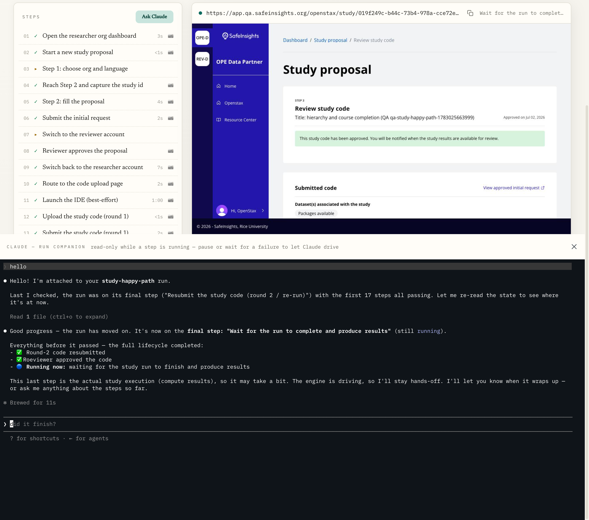

<div align="center">

# 🛡️ qa-review

### Watch your app get tested — step by step, in a real browser.

*A QA runner for [SafeInsights](https://safeinsights.org). Pick a suite, press **Run**,
and watch each step light up green beside a live browser driving the real app.
Every run leaves behind screenshots, a video, and a replayable trace.*


-00ADD8?style=flat-square&logo=go&logoColor=white)


</div>

---



<div align="center">
<em>A <code>study-happy-path</code> run in flight: steps stream green on the left, the embedded
live browser drives the real app top-right, and the <strong>Ask Claude</strong> run companion
sits below — ready to read the run state and drive the frozen browser when a step pauses or fails.</em>
</div>

## Why it exists

Manually clicking through a full study lifecycle — sign in, propose a study, get it
reviewed, upload code, re-run, approve results — is slow, tedious, and easy to get
subtly wrong. **qa-review runs that whole journey for you against a real environment**,
in a real browser, and shows its work: you *see* every step happen and get a permanent
record of what the app did.

It's built for two moments:

- **"Does this still work?"** — press Run on a suite and watch it go, green step by green step.
- **"Why did it break?"** — when a step fails, the browser freezes right where it stopped so you (or Claude) can poke at it live.

## At a glance

| | |
|---|---|
| ▶️ **Pick a suite, press Run** | The GUI lists every step *before* you run it. No config, no test files to read. |
| 👀 **Live browser** | A real Chrome, driven in front of you — embedded right in the app as it runs. |
| ⏸️ **Pause & poke** | Mark any step to pause before it, then take the wheel of the live browser mid-run. |
| 🎬 **A record of every run** | Per-step screenshots, a full video, a replayable Playwright trace, and an HTML report. |
| 🤖 **Ask Claude** | An AI run-companion reads the run state and can drive the frozen browser to help diagnose a failure. |
| ✍️ **Author by doing** | Drive a logged-in browser by hand; an AI flow watches and writes the suite file for you. |
| 🌐 **Any environment** | `qa`, `staging`, or any PR preview (`--pr 839`) — a PR run is a QA run with a different URL. |
| 🔐 **Shared, encrypted logins** | Team account passwords + MFA codes live encrypted in the repo, unlocked per-person (no shared password). |
| 🍎 **Just an app** | Ships as a signed, notarized Mac `.app` — no Node, no checkout, no terminal required. |

## How a run works

```
   Pick suite ──▶  Sign in  ──▶  Step 1 ✓ ──▶ Step 2 ✓ ──▶ … ──▶ Step N ✓  ──▶  Results
                  (auto)         │                                    │
                                 └── live browser you can watch ──────┘
                                        (pause any step to take over)
```

1. **Choose** a suite, an environment (or PR #), and a role. Selecting a suite auto-pins the role it declares.
2. **Run.** The engine signs in with the team account for that role and walks the suite's ordered steps.
3. **Watch.** Each step streams its status; the embedded browser shows the real app being driven live.
4. **Intervene** (optional). Pause before a step to drive the browser yourself, or let it fail and freeze so you can diagnose — with or without the Claude companion.
5. **Review.** When it's done, everything the run did is saved for you (below).

## What every run leaves behind

Each run writes a timestamped folder under `results/` — e.g. `results/2026-07-02_142224_study-happy-path_qa/`:

| Artifact | What it's for |
|---|---|
| `report.html` | A human-readable summary of the run — open it in a browser. |
| `screenshots/` | One screenshot per step, named for the step. |
| `video.webm` | A full-motion recording of the entire run. |
| `trace.zip` | A Playwright trace — drop it on [trace.playwright.dev](https://trace.playwright.dev) to scrub through every action, network call, and DOM snapshot. |
| `summary.json` / `run-state.json` | The machine-readable record (step timings, URLs, console logs) behind the report. |

## Quick start

**Just want to run tests?** Use the desktop app — no setup, no terminal. Launch it,
pick a suite, press Run.

<details>
<summary><strong>Running from the command line (for engineers)</strong></summary>

```bash
pnpm install
pnpm qar list                                        # list suites and their roles
pnpm qar run --suite signin --role researcher --env qa
pnpm qar run --suite study-happy-path --role researcher --pr 839
```

Run the GUI in dev mode:

```bash
cd gui && wails dev
```

The suites that ship today: **`signin`**, **`create-study`**, **`study-happy-path`**, **`discover`**.

</details>

## Configuration

Config lives under `config/` — no `.env` files. Base URLs are plaintext; the shared
account passwords and MFA codes are **encrypted in the repo** and unlocked per-person.

- `settings.json` — committed, plaintext (base URLs).
- `settings.secrets.json` — committed, each value **age-encrypted to the team keyring**.
- `settings.local.json` — gitignored per-user overrides.

### 🔐 Shared secrets, without a shared password

Every teammate has their own key. Secrets are encrypted *to each person* (X25519 age
recipients), so there's no shared passphrase to leak — and access is granted or revoked
one person at a time, through a normal GitHub PR. (Skeptical? See [Security notes](#security-notes).)

```bash
qar request-access --name "Your Name"   # generate your key, open a keyring PR
qar sync                                # fast-forward pull (suites + keyring + secrets)
```

<details>
<summary><strong>How the keyring works (deep dive)</strong></summary>

Each user holds a local identity (`config/age-identity.txt`, gitignored) that never
leaves their machine; their public key lives in the committed `config/keyring.json`
(name, email, public key). `config/keyring.lock` is a committed fingerprint of the
recipient set the secrets were last encrypted to — if it drifts from `keyring.json`,
the GUI shows a "rekey needed" banner.

```bash
qar rekey                               # re-encrypt all secrets to the current keyring
qar set-secret --key <VAR> --value <v>  # encrypt one secret to all recipients
```

**Onboarding is a PR.** `request-access` adds your key to the keyring and opens a PR; a
reviewer runs `qar rekey` on that branch before merging, so there's never a window where
the lock is out of sync. Go encrypts (`filippo.io/age`) and the engine decrypts
(`age-encryption` npm) — the interop is covered by tests.

**Revocation is manual:** drop the entry from `keyring.json`, `qar rekey`, and merge.
A revoked user can still read secrets they already pulled, so rotate the underlying
password/MFA seed if it's truly sensitive. Trust is enforced by **GitHub** (who can
merge keyring PRs), not by the app.

**CI runs keyless:** with no identity present, encrypted secrets are skipped and runtime
secrets come from environment variables instead.

</details>

## For engineers

<details>
<summary><strong>Development & tests</strong></summary>

```bash
pnpm test          # vitest
pnpm typecheck     # tsc --noEmit
pnpm lint          # biome check (CI gate); pnpm lint:fix to auto-fix + format
cd gui && go test ./...
```

Build the standalone Mac app:

```bash
make engine         # bundle just the engine (esbuild)
make dmg-unsigned   # full pipeline minus signing — local smoke test of the .app
make dmg            # signed + notarized .dmg (needs DEVELOPER_ID + NOTARY_PROFILE)
```

</details>

<details>
<summary><strong>Repo layout</strong></summary>

| Path | What |
|------|------|
| `src/engine/` | The run engine — `runEngine()`, env resolution, suite registry |
| `src/suites/` | The actual suites (`signin`, `create-study`, `study-happy-path`, `discover`) |
| `src/cli/` · `bin/qar.ts` | CLI: `run · login · cleanup · codegen · list · migrate · request-access · rekey · set-secret · sync · session` |
| `gui/` | Wails app — Go backend (`app.go`, `settings.go`) + React/Vite frontend |
| `config/` | Environments + layered settings + the keyring |

Suites are plain TypeScript objects (`{ name, steps: [{ name, run(ctx) }] }`), loaded
directly under `tsx` — no compile step. See [CLAUDE.md](CLAUDE.md) for the full architecture.

</details>

## Security notes

Short version: this tool touches **non-production environments only**, no plaintext
credentials are committed, and the desktop build is signed and notarized. The details,
for anyone who should be skeptical:

- **No production access.** Suites run against `qa`, `staging`, and PR previews under
  `qa.safeinsights.org` — never production. The shared accounts are test accounts on
  those environments.
- **No plaintext secrets in the repo.** Account passwords and MFA codes are
  age-encrypted *to each teammate's public key* (X25519), not to a shared passphrase.
  Your private key (`config/age-identity.txt`) and any local overrides
  (`config/settings.local.json`) are **gitignored** and never leave your machine.
- **Access is GitHub-gated and auditable.** Adding or removing a recipient is a normal
  PR against `config/keyring.json`; who can merge is who can grant access. Revocation is
  manual and *does not* retroactively lock a former teammate out of secrets they already
  pulled — rotate the underlying password/MFA seed if that matters. (Stated plainly so
  it isn't a surprise.)
- **CI holds no key.** Continuous integration runs keyless — encrypted secrets are
  skipped and values are injected as environment variables, so the repo's key material
  is never needed in automation.
- **It drives *your* Chrome.** Playwright launches the Chrome already installed on your
  machine (`channel: 'chrome'`) rather than downloading a browser binary — nothing extra
  or untrusted is fetched to run a suite.
- **The Mac app is signed & notarized.** `make dmg` produces a Developer-ID-signed,
  Apple-notarized `.app` with the hardened runtime enabled. On first launch it clones the
  suites repo into a user-writable location using the machine's own `git`/`gh`.

Found something that looks wrong? Please open an issue rather than posting details publicly.
