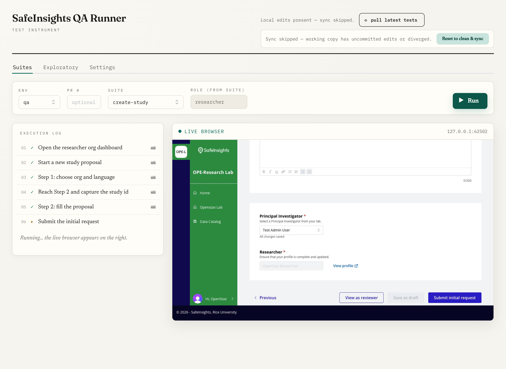

# qa-review

A QA runner for [SafeInsights](https://safeinsights.org). A TypeScript engine
drives Chromium through test suites with Playwright; a [Wails](https://wails.io)
(Go + React/Vite) desktop GUI wraps it for "pick a suite, press Run" use — with a
live browser view, per-step screenshots, and a recording of every run.

The CLI command is `qar`.



*A `create-study` suite mid-run: the execution log streams each step as it passes,
while the embedded live browser shows the real app being driven in real time.*

## What it does

- **Suites are plain TypeScript objects** (`src/suites/`), not Playwright test
  files — easy to read, generate, and share. Each suite declares the role it runs
  as and an ordered `steps` array of named steps (`{ name, run(ctx) }`), so its
  steps are listed in the GUI before you run it, and you can mark a step to pause
  before it and interact with the live browser mid-run.
- **One run, many artifacts** — per-step screenshots, a video recording, a
  Playwright trace (`trace.zip`, replayable at
  [trace.playwright.dev](https://trace.playwright.dev)), and an HTML report.
- **Live browser** — the GUI embeds a CDP screencast of the run as it happens.
- **Environments** — `qa` and `staging` are declared in `config/environments.ts`;
  any PR preview (`prN.app.qa.safeinsights.org`) is reachable with `--pr N`. A PR
  run is identical to a QA run except for the base URL.

## Quick start

```bash
pnpm install
pnpm qar list                                      # list suites and their roles
pnpm qar run --suite signin --role researcher --env qa
pnpm qar run --suite create-study --role researcher --pr 839
```

Run the GUI:

```bash
cd gui && wails dev
```

## Configuration

Config lives under `config/` in three layered files (see [CLAUDE.md](CLAUDE.md)
for the full story):

1. `settings.json` — committed, plaintext (base URLs).
2. `settings.secrets.json` — committed, each value **age-encrypted to the team
   keyring** (X25519). Holds the shared accounts' passwords + per-account MFA codes.
3. `settings.local.json` — gitignored per-user overrides.

### Multi-user secrets

Secrets are encrypted to **per-user age keys**, not a shared passphrase. Each user
holds a local identity (`config/age-identity.txt`, gitignored); their public key
lives in the committed `config/keyring.json`.

```bash
qar request-access --name "Your Name"   # generate your key, open a keyring PR
qar rekey                               # re-encrypt secrets to the current keyring
qar set-secret --key <VAR> --value <v>  # encrypt one secret to all recipients
qar sync                                # fast-forward pull (suites + keyring + secrets)
```

CI runs **keyless**: with no identity present, encrypted secrets are skipped and
runtime secrets come from environment variables instead.

## Development

```bash
pnpm test          # vitest
pnpm typecheck     # tsc --noEmit
cd gui && go test ./...
```

## Layout

| Path | What |
|------|------|
| `src/engine/` | The run engine — `runEngine()`, env resolution, suite registry |
| `src/suites/` | The actual suites (`signin`, `create-study`, …) |
| `src/cli/` · `bin/qar.ts` | CLI: `run · login · cleanup · codegen · list · migrate · request-access · rekey · set-secret · sync` |
| `gui/` | Wails app — Go backend (`app.go`, `settings.go`) + React/Vite frontend |
| `config/` | Environments + layered settings + the keyring |
